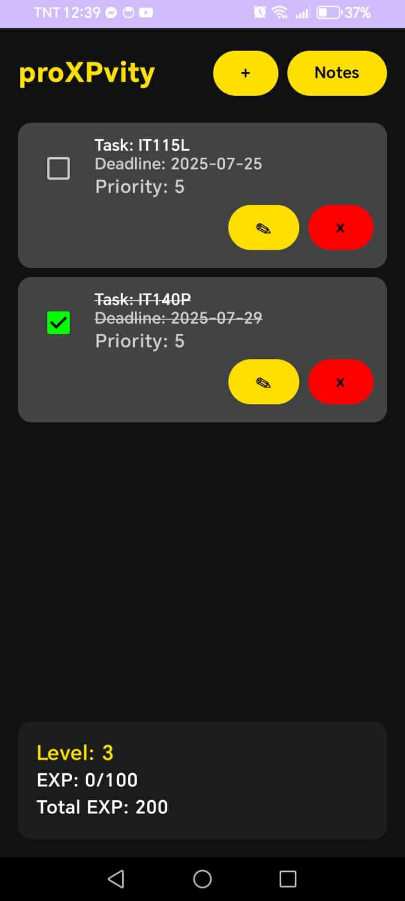

proXPvity reimagines the to-do list as a game. Instead of a flat checklist, completing tasks earns XP and levels up the user's profile, turning everyday productivity tracking into something closer to a rewarding game loop than a chore.

Users can set tasks, assign deadlines, and mark priority levels, earning points as activities are completed. Progress is reflected through leveling, giving users a tangible sense of momentum and helping them stay aware of their own productivity over time.

Built with Kotlin and Android Studio on the front end, backed by Ktor, XAMPP, and Oracle SQL Developer, the app required building both the gamified mobile interface and the backend systems tracking tasks, XP, and user progress. As Lead Front-End and Back-End Developer, the role spanned the full stack of the application.