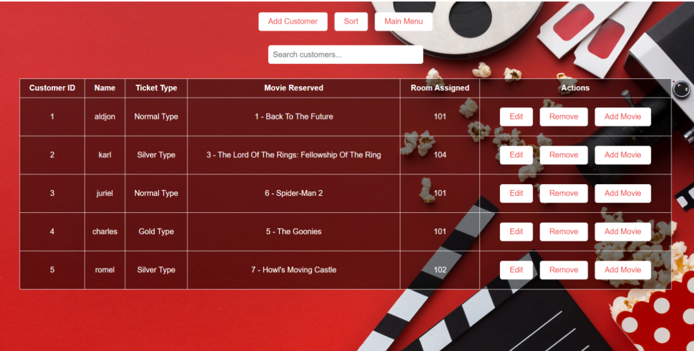

Retro Movie Database is a locally hosted website built to demonstrate full-cycle database interaction for a Fundamentals of Database Systems class project. Rather than a purely academic exercise, the project was designed as a working movie catalog, wrapped in a retro-themed front-end interface.

The site supports data retrieval, insertion, and management directly through the UI, fully integrated with an Oracle Database on the backend. Built using PHP and hosted locally through XAMPP with Apache, the project required handling both the visual front end and the underlying database logic that powers it.

As a solo project, the work covered the entire stack: designing the retro-styled interface, structuring the Oracle database, and writing the PHP logic connecting the two together.