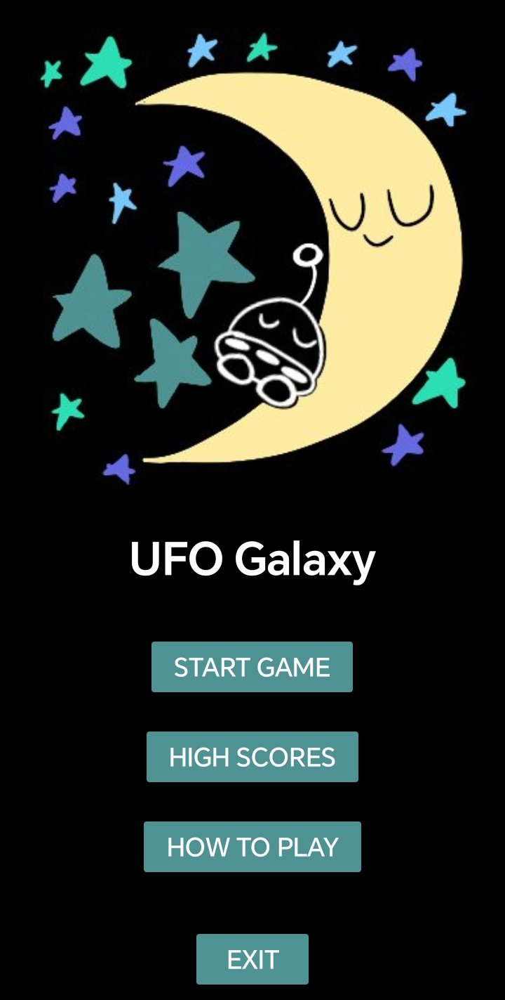
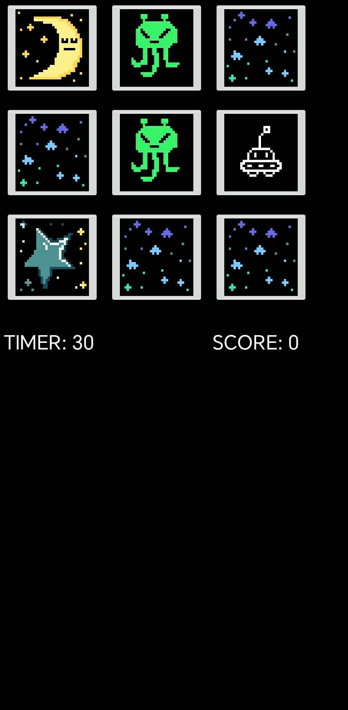

UFO Galaxy was built as a machine problem for an Integrative Programming class, with the goal of demonstrating a solid understanding of Object-Oriented Programming principles alongside local data persistence in a mobile environment. Rather than a simple exercise, the project was approached as a small, complete game: a UFO navigating a 3x3 grid, collecting stars, and fighting off aliens for points.

Built using Xamarin, the game required structuring game logic, state, and save data around clean OOP principles, ensuring that the codebase remained organized and extensible despite the game's compact scope. A key technical focus was local data persistence, implemented by saving game data to a local text file within the app so that progress could be preserved between sessions.

As Lead Programmer and Designer, the role covered both the technical architecture of the game and its design, from grid navigation to the scoring system. The result was a functional, self-contained mobile game that met the academic requirements of the course while serving as a hands-on demonstration of core programming concepts in practice.